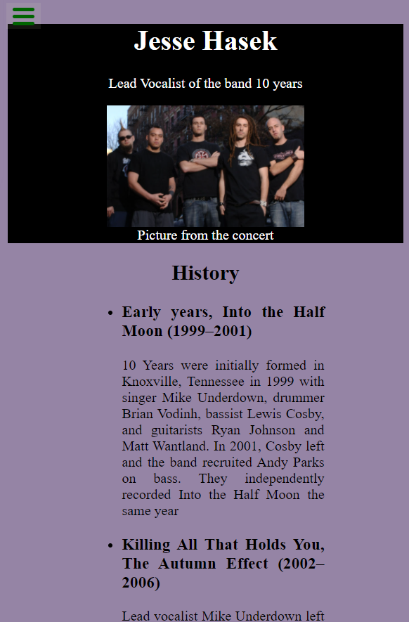
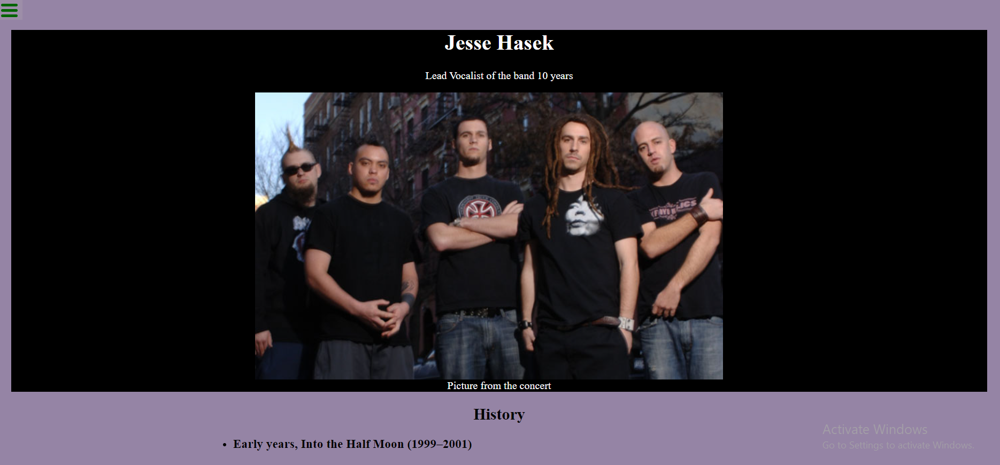

# Build a Tribute Page

This is a solution to the [Build a Tribute Page](https://tenyears.netlify.app/).FreeCodeCamp projects help you improve your coding skills by building realistic projects.

## Table of contents

- [Overview](#overview)
  - [Screenshot](#screenshot)
  - [Links](#links)
- [My process](#my-process)
  - [Built with](#built-with)
  - [What I learned](#what-i-learned)
  - [Continued development](#continued-development)
- [Author](#author)

## Overview

Focus is on centering image and give some text,style and write correctly HTML and CSS.

### Screenshot





### Links

- Solution URL: [https://github.com/Holllyyyy/tribute-page](https://github.com/Holllyyyy/tribute-page)
- Live Site URL: [https://tenyears.netlify.app/](https://tenyears.netlify.app/)

## My process

I started with writing basic HTML where I just added picture and text about this rock band. After it I moved on my style. I make css folder, and wrote basic css.
I started with this:
In html i put some lists and texts, because its longer text.

```css
* {
  padding: 0%;
  margin: 0%;
  box-sizing: border-box;
} /*just basic what I need to not have later problem with paddings,margins,heights to go out of box thats why i always put border box*/
body {
  background-color: rgb(149, 132, 165);
  color: black;
  width: 100%;
  min-height: 100%;
} /* here I added just colors for backround and text anf also i used width of 100 n height min.*/

#image {
  max-width: 100%;
  display: block;
  margin: auto;
} /* this is way how i made image to be centered*/
#img-div {
  display: block;
  margin-left: auto;
  margin-right: auto;
  width: 50%;
} /* cause of parent and child i needed to make here stuff also, by putting it to be centered and width of 50%, at the first moment when I wrote this code, I didnt centered pic inside div so that was my problem , but while I was writing I corrected it*/

ul {
  display: block;
  text-align: center;
  text-align: justify;
  text-justify: auto;
  margin: 1% 20% 1% 20%;
} /* here I just make texts for my unorder lists and justify text so it will look better*/

span {
  margin: 1% 0 1% 0;
  font-style: italic;
  font-weight: bold;
} /* part where i made my text to be italic cause its some quote*/
```

### Built with

- Semantic HTML5 markup
- CSS custom properties

### What I learned

While working on this project I learned:
-how to centered picture inside div
=How to justify text
-How to make lists
-how I can combine all together.

### Continued development

I will continue next with Build a Survey Form, from freeCodeCamp. I want to practice and improve my HTML and CSS skills.

## Author

- Website - [Svetlana Jokic](https://my-portfolio-hollyy.netlify.app/)
- Frontend Mentor - [@Holllyyyy](https://www.frontendmentor.io/profile/Holllyyyy)
- Twitter - [@svetlanajokic](https://twitter.com/svetlanajokic)
- LinkedIn - [@Svetlana Jokic](https://www.linkedin.com/in/svetlana-jokic-787432100/)
- FreeCodeCamp - [@hollyy](https://www.freecodecamp.org/hollyy)
